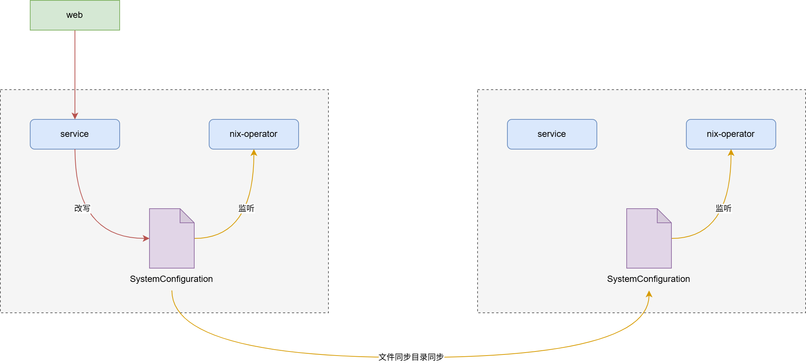

我需要开发一个类似于kubernetes中operator具有调谐能力的软件，它要支持的功能如下：

1. 完成linux系统特定网卡的ip、网关、MTU、MAC地址修改

2. 完成linux系统dns的修改

3. 完成linux系统hosts的修改

4. 完成linux系统防火墙的修改

5. 完成linux系统时间、时区的修改

6. 完成ntp服务的修改

7. 设置串口参数

8. 通过udev识别硬件并进行识别号固定

需要模仿CRD的开发，先设计CRD的yaml文件，要求能描述上述修改的配置，然后设计operator的代码，要求能根据CRD的配置完成上述修改。

需要使用go语言开发，但是并不需要k8s的任何代码，只需要使用go语言开发即可，也不需要运行在k8s集群中，只需要在裸机上运行即可。

